# 知识图谱智能平台
这是一个通用知识图谱构建和应用平台，可以应用于多个不同领域，例如教育、医疗医药、司法、金融、农业、工业、商业、旅游等。目前以网页形式展现，并以医学领域为例展示功能。

医学是知识图谱应用较广的垂直领域之一，也是目前国内外人工智能领域研究的热点。医学知识图谱在临床诊断、治疗、预后等方面均可发挥较大的作用。高效地将知识图谱应用于医学领域将给人类的医疗卫生带来革命性的变化。

该平台的功能包括：
1. 通过多类型数据构建知识图谱，包括结构化数据，非结构化数据 - 例如文本和对话语音。
2. 多版本知识图谱的存储和管理。
3. 医学领域命名实体识别及关系识别。
4. 基于医疗知识图谱的自动问答。

# 内容列表

- [知识图谱智能平台](#知识图谱智能平台)
- [内容列表](#内容列表)
- [技术架构](#技术架构)
- [环境安装](#环境安装)
- [功能列表](#功能列表)
  - [1. 知识图谱的构建](#1-知识图谱的构建)
     - [通过结构化数据构建 - Json文件构建](#通过结构化数据构建---json文件构建)
     - [通过非结构化数据构建](#通过非结构化数据构建)
  - [2. 实体及关系识别](#2-实体及关系识别)
     - [2.1 基于BART的实体关系联合抽取](#21-基于bart的实体关系联合抽取)
     - [2.2 基于SOTA工具](#22-基于sota工具)
  - [3. 基于医疗知识图谱的自动问答](#3-基于医疗知识图谱的自动问答)
     - [技术架构](#技术架构-1)
     - [支持问答类型](#支持问答类型)
     - [问答结果展示](#问答结果展示)
     - [实现原理](#实现原理)
       - [问句类型分类](#问句类型分类)
       - [问句解析](#问句解析)
       - [问题查询](#问题查询)
       - [问答程序](#问答程序)
  - [4. 基于聊天(对话)语音构建知识图谱](#4-基于聊天对话语音构建知识图谱)

# 技术架构
本系统的开发采用前后端分离的方式，使用Resful API进行前后端信息传输。
- 前端框架：`Vue`
- 后端框架：`Django`
- 数据库：图数据库`Neo4j` 关系型数据库`Sqlite`
- 深度学习框架: `Tensorflow`, `PyTorch`
- 算法编程语言：`Python3`
- 重要的库: `py2neo`, `pyahocorasick`, `transformers`, `urllib`
# 环境安装

这个项目使用的所有库都在[requirements.txt](requirements.txt)。请在本地安装虚拟环境，并确保安装了它们。

```sh
# create virtual environment (for example, conda)
conda create -n kg python=3.6
conda activate kg
pip3 install -r requirements.txt
```

# 功能列表
## 1. 知识图谱的构建
### 基于垂直网站数据的医药知识图谱构建 - 结构化数据文件构建
（约1000行代码）
1. 首先创建图谱名。如果图谱名已经存在于数据库，则会提示名字重复。否则将图谱名称存入缓存。图谱名会作为当前图谱所有实体和关系的一个属性存进Neo4j数据库，以区分不同图谱的数据。
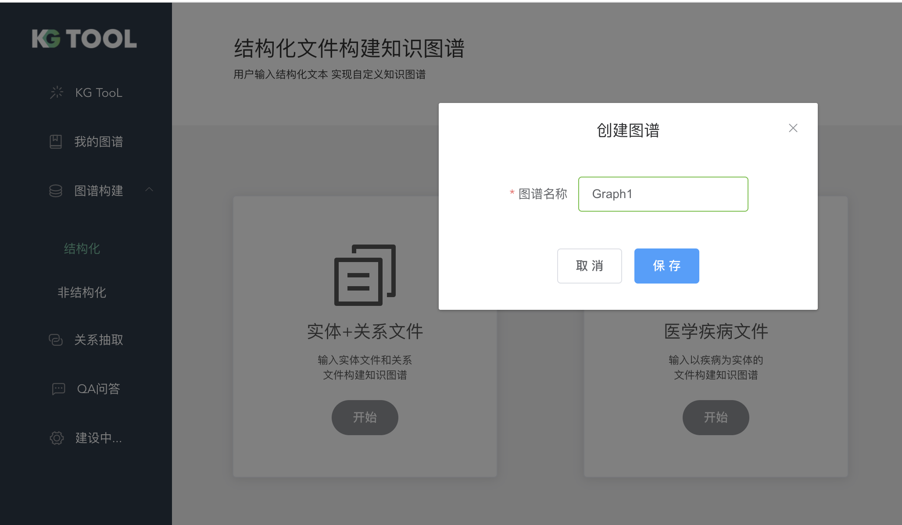


1. 上传指定格式的文件。在点击疾病文件后，选择[medical.json](/data/medical.json)(完整数据)，或者[part_medical.json](/data/part_medical.json)(部分数据)，或者按照**指定格式**自行构造数据上传。文件会默认上传到Neo4j数据库的import文件夹下。此路径可以在[config.py](/kgproject/config.py)的`BASE_IMPORT_URL`变量中设置。


- 相应的json文件数据应为下图格式的数据。

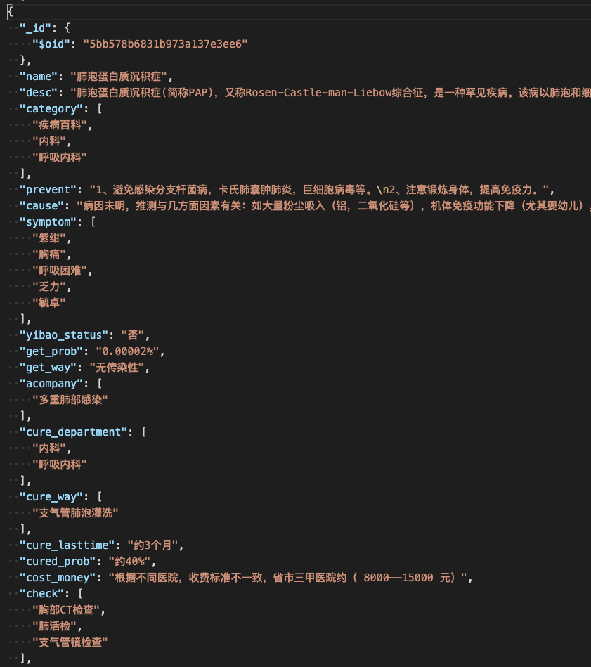

- 在上传的时候，一条实体应该为独立一行，如下图。

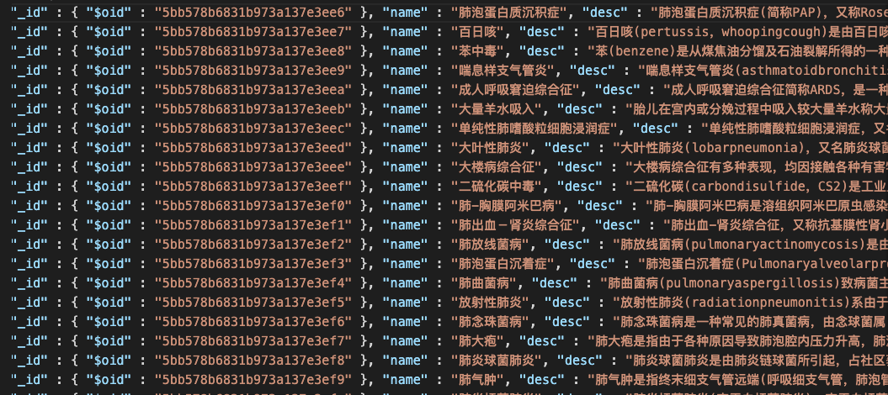

3. 定义本体和关系。
- 可以通过拖拽本体和关系框的方式定义，也可以删除不需要的本体和关系
- 可以给本体添加中文名称和实体属性

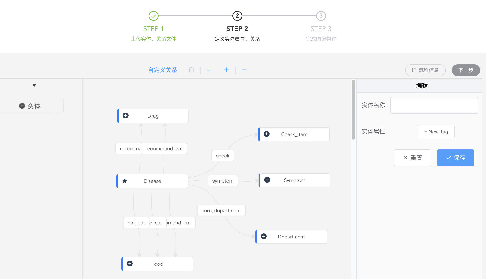

4. 下一步完成图谱构建，图谱会随机展示部分实体和关系。不同的颜色表示不同的本体。箭头表示的是实体间的关系。

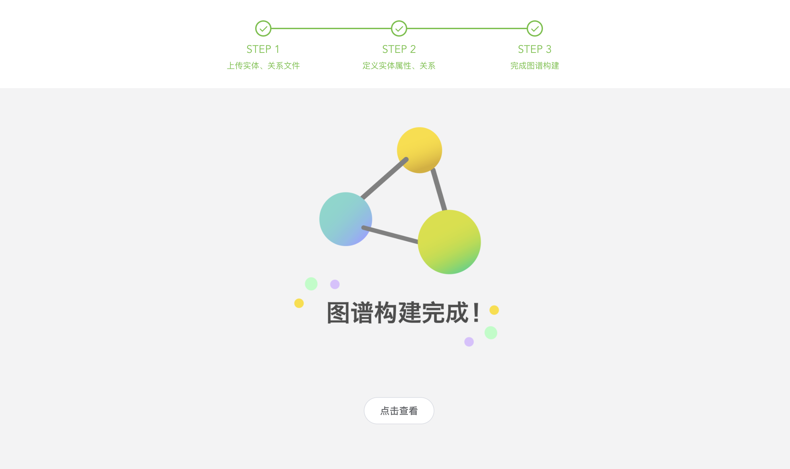
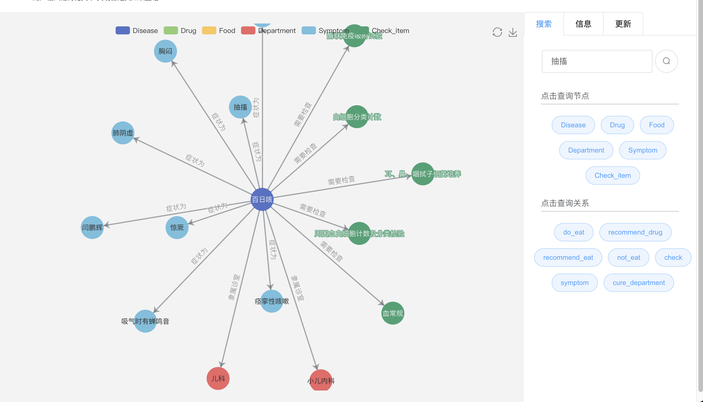

### 信息检索
- 点击节点可以查看它的属性信息
<p float="left">
  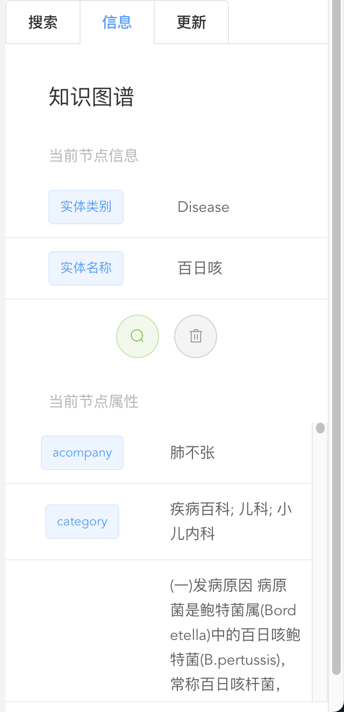
  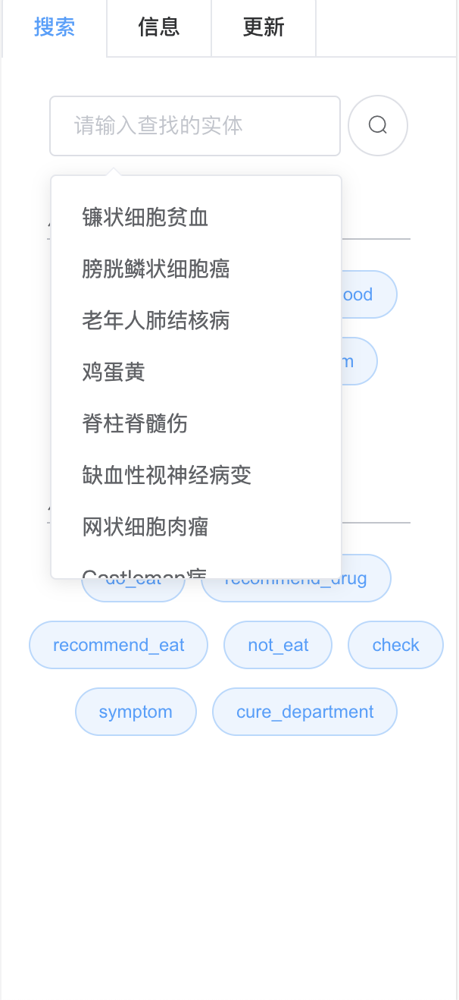
</p>

- 根据本体查找实体
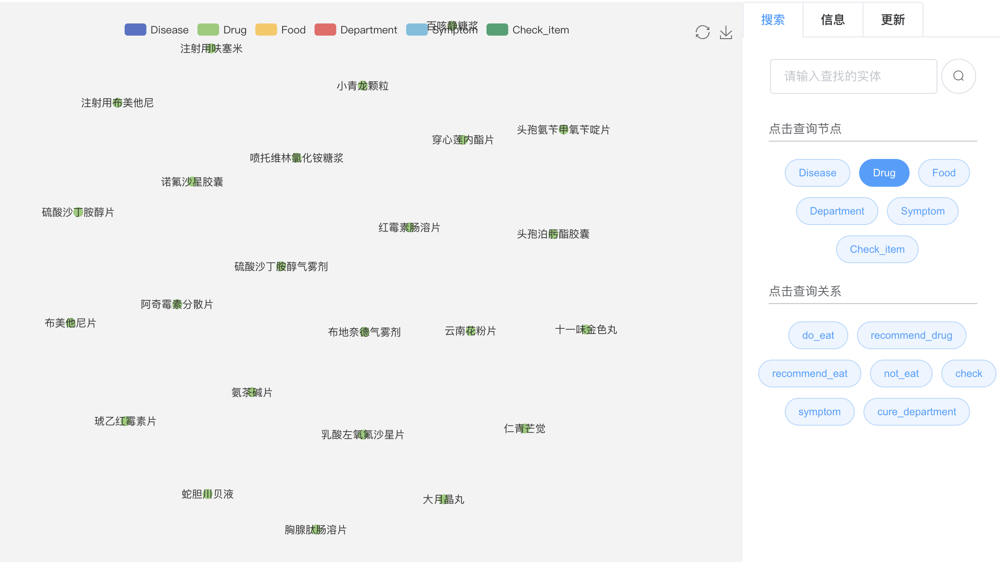

- 根据关系查找所有实体和关系
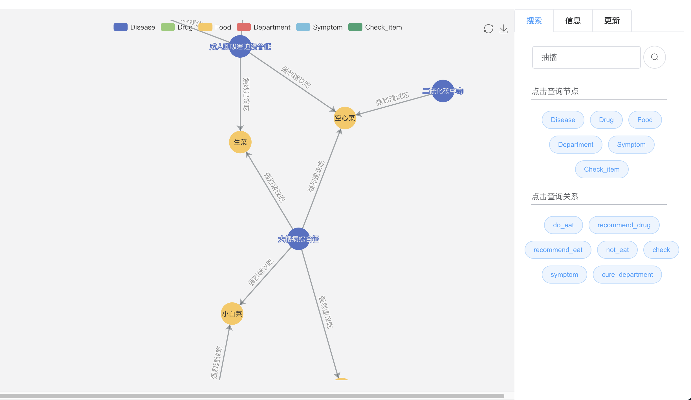

### 实现原理
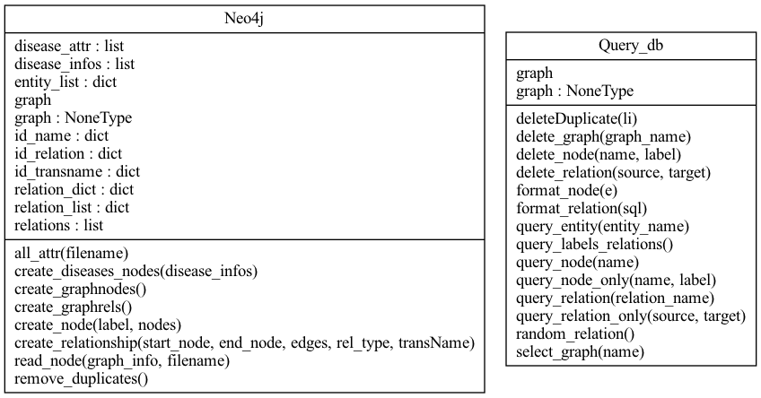
节点和关系的创建，以及查询主要是用的py2neo连接Django后端和Neo4j数据库。


### 知识图谱的保存，更新和版本管理
- 构建的知识图谱可以保存到数据库，并在需要的时候随时查看。
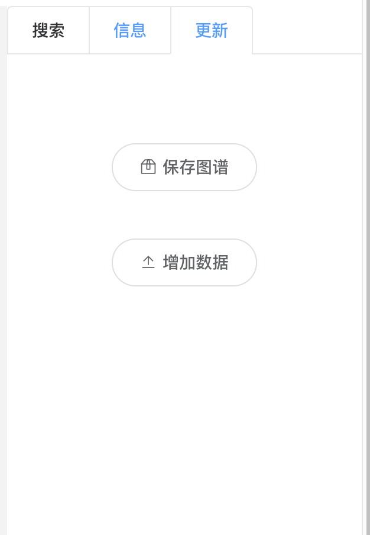

- 下图是数据库模型，数据库将保存知识图谱的名称、包含的本体（标签）和关系类型，图谱建立的时间。
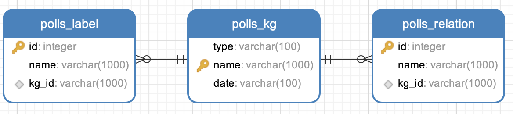

- 系统会展示所有的图谱，你可以选择现有图谱进行查看。
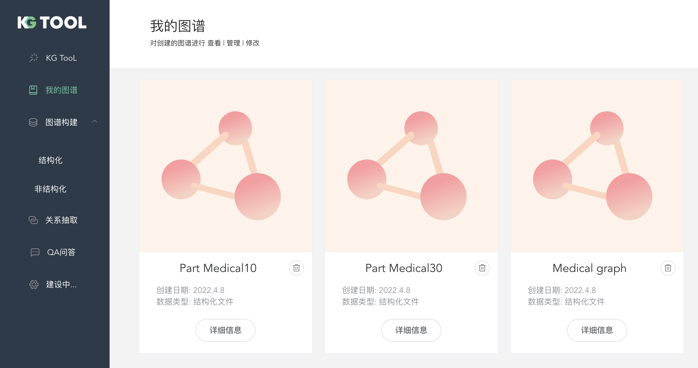

- 点击想查看的图谱，系统会展示当前图谱包含的所有本体和关系。
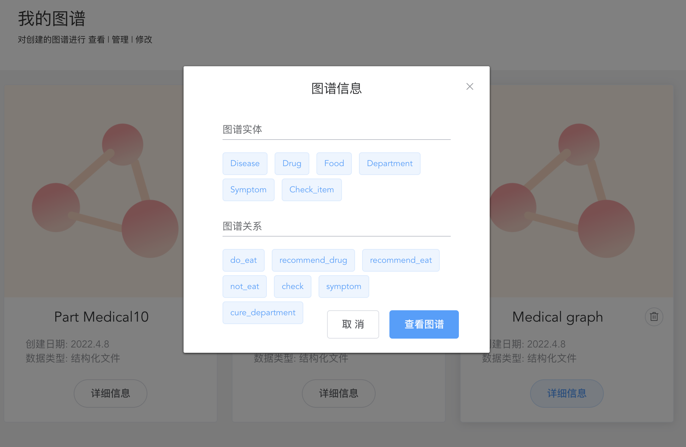


### 知识图谱实体和关系类型

| 实体类型   |   中文含义   | 实体数量 | 举例                                   |
| :--------- | :----------: | :------: | :------------------------------------- |
| Check      | 诊断检查项目 |  3,353   | 支气管造影;关节镜检查                  |
| Department |   医疗科目   |    54    | 整形美容科;烧伤科                      |
| Disease    |     疾病     |  8,807   | 血栓闭塞性脉管炎;胸降主动脉动脉瘤      |
| Drug       |     药品     |  3,828   | 京万红痔疮膏;布林佐胺滴眼液            |
| Food       |     食物     |  4,870   | 番茄冲菜牛肉丸汤;竹笋炖羊肉            |
| Producer   |   在售药品   |  17,201  | 通药制药青霉素V钾片;青阳醋酸地塞米松片 |
| Symptom    |   疾病症状   |  5,998   | 乳腺组织肥厚;脑实质深部出血            |
| Total      |     总计     |  44,111  | 约4.4万实体量级                        |


| 实体关系类型   |   中文含义   | 关系数量 | 举例                                                 |
| :------------- | :----------: | :------: | :--------------------------------------------------- |
| belongs_to     |     属于     |  8,844   | <妇科,属于,妇产科>                                   |
| common_drug    | 疾病常用药品 |  14,649  | <阳强,常用,甲磺酸酚妥拉明分散片>                     |
| do_eat         | 疾病宜吃食物 |  22,238  | <胸椎骨折,宜吃,黑鱼>                                 |
| drugs_of       | 药品在售药品 |  17,315  | <青霉素V钾片,在售,通药制药青霉素V钾片>               |
| need_check     | 疾病所需检查 |  39,422  | <单侧肺气肿,所需检查,支气管造影>                     |
| no_eat         | 疾病忌吃食物 |  22,247  | <唇病,忌吃,杏仁>                                     |
| recommand_drug | 疾病推荐药品 |  59,467  | <混合痔,推荐用药,京万红痔疮膏>                       |
| recommand_eat  | 疾病推荐食谱 |  40,221  | <鞘膜积液,推荐食谱,番茄冲菜牛肉丸汤>                 |
| has_symptom    |   疾病症状   |  5,998   | <早期乳腺癌,疾病症状,乳腺组织肥厚>                   |
| acompany_with  | 疾病并发疾病 |  12,029  | <下肢交通静脉瓣膜关闭不全,并发疾病,血栓闭塞性脉管炎> |
| Total          |     总计     | 294,149  | 约30万关系量级                                       |

- 知识图谱属性类型

| 属性类型      |   中文含义   |            举例             |
| :------------ | :----------: | :-------------------------: |
| name          |   疾病名称   |       喘息样支气管炎        |
| desc          |   疾病简介   |    又称哮喘性支气管炎...    |
| cause         |   疾病病因   |    常见的有合胞病毒等...    |
| prevent       |   预防措施   | 注意家族与患儿自身过敏史... |
| cure_lasttime |   治疗周期   |          6-12个月           |
| cure_way      |   治疗方式   |   "药物治疗","支持性治疗"   |
| cured_prob    |   治愈概率   |             95%             |
| easy_get      | 疾病易感人群 |        无特定的人群         |

### 通过非结构化数据构建
1. 命名实体识别，关系抽取
2. 通过实体的类型、关系类型构建图谱


## 2. 实体及关系识别
### 2.1 基于BART的实体关系联合抽取
训练分为两部分：
- 实体识别
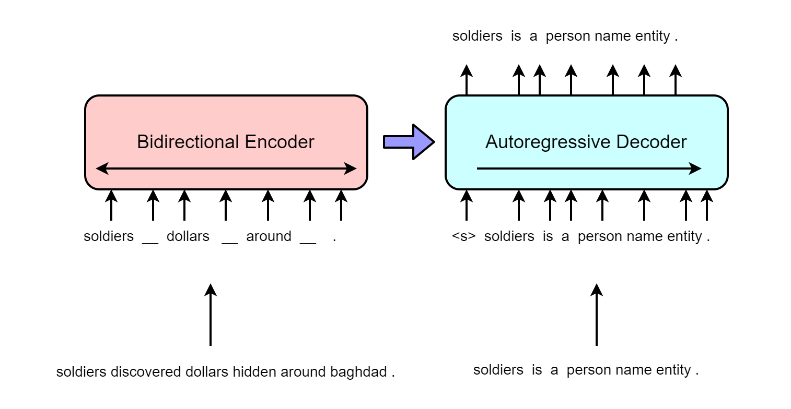
- 关系提取
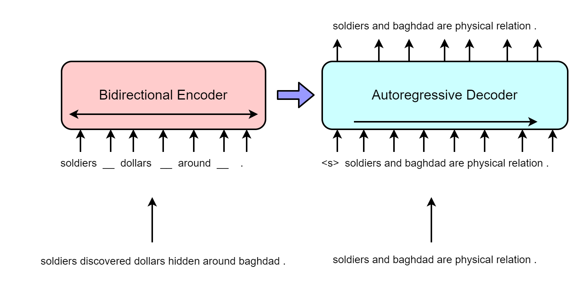
两部分采用共享参数方式进行训练
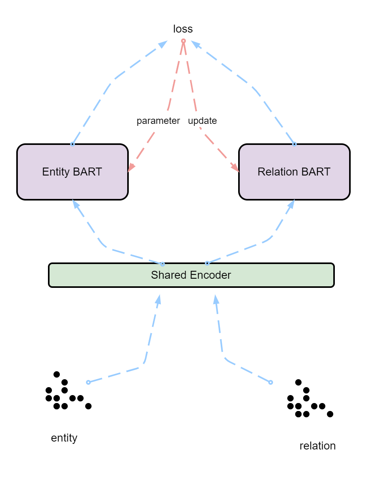
### 2.2 基于SOTA工具
- 实体关系识别（NER）：[Spacy 2.3.7](https://spacy.io/)
- 共指消解（Coreference resolution）: [neuralcoref 4.0](https://spacy.io/universe/project/neuralcoref)
- 实体链接（Entity linking）:
  - [Wikifier](https://wikifier.org/info.html)
  - [REL: Radboud Entity Linker](https://github.com/informagi/REL), [Paper](https://arxiv.org/abs/2006.01969)
- 关系抽取（Relation Extraction）:[OpenNRE](https://github.com/thunlp/OpenNRE)
## 3. 基于医疗知识图谱的自动问答
目前，对医学相关知识的搜索主要通过传统搜索引擎，然而这些方式不能返回给用户最直接的答案，而是一些与问题相关的网页或者文档，用户需要再次从这些网页或者文档中寻找最终想要的答案。尤其对于非医学专业人员，他们对医学知识了解不深，寻找答案会更加困难。此外，答案质量参差不齐，用户在查找、获取、理解方面会存在许多困难。

该系统集成了医学专业知识，知识图谱和通过自然语言进行人机对话的问答系统。该系统对医学领域进行定位，利用爬虫技术将垂直的医学网站用作数据源，并以疾病为核心实体，构建包含实体规模4.4万，实体关系规模30万的知识图谱。它使用基于规则的匹配方法和字符串匹配算法来构造域词典，以对问题进行分类和查询。

这个智能问答系统不仅可以允许用户以自然语言方式提问，还能返回给用户准确、简洁的答案，不需要用户再次筛选合适的答案。将智能问答系统应用于医学领域，能够进一步提高人们获取健康知识的便捷性、准确性。
### 技术架构


### 支持问答类型

| 问句类型         |        中文含义        |         问句举例         |
| :--------------- | :--------------------: | :----------------------: |
| disease_symptom  |        疾病症状        |   乳腺癌的症状有哪些？   |
| symptom_disease  |   已知症状找可能疾病   |   最近老流鼻涕怎么办？   |
| disease_cause    |        疾病病因        |   为什么有的人会失眠？   |
| disease_acompany |      疾病的并发症      |    失眠有哪些并发症？    |
| disease_not_food |   疾病需要忌口的食物   |    失眠的人不要吃啥？    |
| disease_do_food  |   疾病建议吃什么食物   |      耳鸣了吃点啥？      |
| food_not_disease | 什么病最好不要吃某事物 |  哪些人最好不好吃蜂蜜？  |
| food_do_disease  |   食物对什么病有好处   |     鹅肉有什么好处？     |
| disease_drug     |      啥病要吃啥药      |      肝病要吃啥药？      |
| drug_disease     |      药品能治啥病      |   板蓝根颗粒能治啥病？   |
| disease_check    |   疾病需要做什么检查   |  脑膜炎怎么才能查出来？  |
| check_disease    |     检查能查什么病     | 全血细胞计数能查出啥来？ |
| disease_prevent  |        预防措施        |    怎样才能预防肾虚？    |
| disease_lasttime |        治疗周期        |    感冒要多久才能好？    |
| disease_cureway  |        治疗方式        |     高血压要怎么治？     |
| disease_cureprob |        治愈概率        |     白血病能治好吗？     |
| disease_easyget  |      疾病易感人群      |   什么人容易得高血压？   |
| disease_desc     |        疾病描述        |          糖尿病          |

### 问答结果展示

        用户:乳腺癌的症状有哪些？
        医疗助手: 乳腺癌的症状包括：乳腺癌的远处转移；胸痛；乳头溢液；乳头破碎；肝肿大；泌乳障碍；乳头内陷；乳房肿块；剧痛
        ******************************************************************************************
        用户:最近老流鼻涕怎么办？
        医疗助手: 症状流鼻涕可能染上的疾病有：枯草热；副流行性感冒；急性上呼吸道感染；硫化氢中毒；小儿衣原体肺炎；风寒感冒；慢性额窦炎；鼻源性头痛；人禽流行性感冒；小儿流行性喘憋性肺炎；病毒性感冒；慢性鼻炎；风热犯肺；感冒；顿呛；小儿急性上呼吸道感染；嗜酸细胞增多性非变态反应性鼻炎；干酪性鼻窦炎；下呼吸道感染；麻疹
        ******************************************************************************************
        用户:为什么有的人会失眠？
        医疗助手: 失眠可能的成因有：躯体疾病和服用药物可以影响睡眠，如消化不良，头痛，背痛，关节炎，心脏病，糖尿病，哮喘，鼻窦炎，溃疡病，或服用某些影响中枢神经的药物。
        由于生活方式引起睡眠问题也很常见，如饮用咖啡或茶叶，晚间饮酒，睡前进食或晚饭较晚造成满腹食物尚未消化，大量吸烟，睡前剧烈的体力活动，睡前过度的精神活动，夜班工作，白天小睡，上床时间不规律，起床时间不规律。
        可能的原因有压力很大，过度忧虑，紧张或焦虑，悲伤或抑郁，生气，容易出现睡眠问题。
        吵闹的睡眠环境，睡眠环境过于明亮，污染，过度拥挤。
        ******************************************************************************************
        用户:失眠有哪些并发症？
        医疗助手: 失眠的症状包括：心肾不交；神经性耳鸣；咽鼓管异常开放症；偏执狂；十二指肠胃反流及胆汁反流性胃炎；腋臭；黧黑斑；巨细胞动脉炎；Stargardt病；抑郁症；腔隙性脑梗死；甲状腺功能亢进伴发的精神障碍；紧张性头痛；胃下垂；心血虚；迷路震荡；口腔结核性溃疡；痰饮；游走性结节性脂膜炎；小儿脑震荡
        ******************************************************************************************
        用户:失眠的人不要吃啥？
        医疗助手: 失眠忌食的食物包括有：油条；河蚌；猪油（板油）；淡菜(鲜)
        ******************************************************************************************
        用户:耳鸣了吃点啥？
        医疗助手: 耳鸣宜食的食物包括有：南瓜子仁;鸡翅;芝麻;腰果
        推荐食谱包括有：紫菜芙蓉汤;羊肉汤面;油豆腐油菜;紫菜鸡蛋莲草汤;乌药羊肉汤;可乐鸡翅;栗子鸡翅;冬菇油菜心
        ******************************************************************************************
        用户:哪些人最好不好吃蜂蜜？
        医疗助手: 患有散发性脑炎伴发的精神障碍；情感性心境障碍；蝎螫伤；四肢淋巴水肿；农药中毒所致的精神障碍；肝错构瘤；细菌性肺炎；急性高原病；小儿颅后窝室管膜瘤；柯萨奇病毒疹；眼眶静脉性血管瘤；乙脑伴发的精神障碍；晚期产后出血；吸入性肺炎；腓总神经损伤；铍及其化合物引起的皮肤病；猝死型冠心病；彼得异常；过敏性急性小管间质性肾炎；小儿腹胀的人最好不要吃蜂蜜
        ******************************************************************************************
        用户:鹅肉有什么好处？
        医疗助手: 患有子宫内膜厚；呼吸疾病；肛肠病；闭经；丧偶后适应性障碍；宫颈外翻；巨球蛋白血症；急性颌下腺炎；锥体外系损害；腺样体炎；咳嗽；错构瘤；牙科病；子宫内膜炎；闭锁综合征；结膜炎；恶性淋巴瘤；足外翻；神经炎；病理性近视的人建议多试试鹅肉
        ******************************************************************************************
        用户:肝病要吃啥药？
        医疗助手: 肝病宜食的食物包括有：鹅肉;鸡肉;鸡肝;鸡腿
        推荐食谱包括有：小米红糖粥;小米蛋奶粥;扁豆小米粥;黄豆小米粥;人参小米粥;小米粉粥;鲜菇小米粥;芝麻小米粥
        肝病通常的使用的药品包括：恩替卡韦分散片；维生素C片；二十五味松石丸；拉米夫定胶囊；阿德福韦酯片
        ******************************************************************************************
        用户:板蓝根颗粒能治啥病？
        医疗助手: 板蓝根颗粒主治的疾病有流行性腮腺炎；喉痹；喉炎；咽部异感症；急性单纯性咽炎；腮腺隙感染；过敏性咽炎；咽囊炎；急性鼻咽炎；喉水肿；慢性化脓性腮腺炎；慢性咽炎；急性喉炎；咽异感症；鼻咽炎；锁喉痈；小儿咽喉炎；喉返神经损伤；化脓性腮腺炎；喉血管瘤,可以试试
        ******************************************************************************************
        用户:脑膜炎怎么才能查出来？
        医疗助手: 脑膜炎通常可以通过以下方式检查出来：脑脊液钠；尿常规；Fisher手指试验；颈项强直；脑脊液细菌培养；尿谷氨酰胺；脑脊液钾；脑脊液天门冬氨酸氨基转移酶；脑脊液病原体检查；硝酸盐还原试验
        ******************************************************************************************
        用户:怎样才能预防肾虚？
        医疗助手: 肾虚可能的成因有：1、多因房劳过度，或少年频繁手淫。2、思虑忧郁，损伤心脾，则病及阳明冲脉。3、恐惧伤肾，恐则伤肾。4、肝主筋，阴器为宗筋之汇，若情志不遂，忧思郁怒，肝失疏泄条达，则宗筋所聚无能。5、湿热下注，宗筋弛纵。
        肾虚是肾脏精气阴阳不足所产生的诸如精神疲乏、头晕耳鸣、健忘脱发、腰脊酸痛、遗精阳痿、男子不育、女子不孕、更年期综合征等多种病证的一个综合概念。关于肾虚形成的原因，可归结为两个方面，一为先天禀赋不足，二为后天因素引起。
        从引起肾虚的先天因素来看，首先是先天禀赋薄弱。《灵枢.寿天刚柔》篇说：“人之生也，有刚有柔，有弱有强。”由于父母体弱多病，精血亏虚时怀孕;或酒后房事怀孕;或年过五十精气力量大减之时怀孕;或男女双方年龄不够，身体发育不完全结婚，也就是早婚时怀孕，或生育过多，精血过度耗损;或妊娠期中失于调养，胎气不足等等都可导致肾的精气亏虚成为肾虚证形成的重要原因;其次，如果肾藏精功能失常就会导致性功能异常，生殖功能下降，影响生殖能力，便会引起下一代形体虚衰，或先天畸形、痴呆、缺陷、男子出现精少不育、早泄，女子出现闭经不孕、小产、习惯性流产等等。
        肾虚的预防措施包括：肾虚日常预防
        在预防方面，因起病与恣情纵欲有关的，应清心寡欲，戒除手淫;如与全身衰弱、营养不良或身心过劳有关的，应适当增加营养或注意劳逸结合，节制性欲。
        1、性生活要适度，不勉强，不放纵。
        2、饮食方面：无力疲乏时多吃含铁、蛋白质的食物，如木耳、大枣、乌鸡等;消化不良者多喝酸奶，吃山楂;平日护肾要多吃韭菜、海参、人参、乌鸡、家鸽等。
        3、经常进行腰部活动，这些运动可以健运命门，补肾纳气。还可多做一些刺激脚心的按摩，中医认为，脚心的涌泉穴是浊气下降的地方，经常按摩涌泉穴，可益精补肾、强身健体、防止早衰，并能舒肝明目，清喉定心，促进睡眠，增进食欲。
        4、充足的睡眠也是恢复精气神的重要保障，工作再紧张，家里的烦心事再多，到了该睡觉的时候也要按时休息。
        健康教育
        1、过度苦寒、冰凉的食物易伤肾，如芦荟、苦瓜、雪糕、鹅肉、啤酒进食过多都伤肾，应该多食黑色素含量高和温补性中药如黑米黑豆等。
        2、男性接触过多的洗涤剂也伤肾，家庭应少用洗涤剂清洗餐具及蔬果，以免洗涤剂残留物被过多摄入。
        3、适当运动可延缓衰老，但强度不宜太大，应选能力所及的运动项目，以促进血液循环，可改善血淤、气损等情况。散步、慢跑、快步走，或在鹅卵石上赤足适当行走，都会促进血液循环，对肾虚有辅助治疗作用。
        4、保持良好的作息习惯，尽量避免熬夜。
        5、积极参加户外运动，放松心情。
        6、不要给自己太大的压力，学会合理减压。
        ******************************************************************************************
        用户:感冒要多久才能好？
        医疗助手: 感冒治疗可能持续的周期为：7-14天
        ******************************************************************************************
        用户:高血压要怎么治？
        医疗助手: 高血压可以尝试如下治疗：药物治疗;手术治疗;支持性治疗
        ******************************************************************************************
        用户:白血病能治好吗？
        医疗助手: 白血病治愈的概率为（仅供参考）：50%-70%
        ******************************************************************************************
        用户:什么人容易得高血压？
        医疗助手: 高血压的易感人群包括：有高血压家族史，不良的生活习惯，缺乏运动的人群
        ******************************************************************************************
        用户:糖尿病
        医疗助手: 糖尿病,熟悉一下：糖尿病是一种比较常见的内分泌代谢性疾病。该病发病原因主要是由于胰岛素分泌不足，以及胰升高血糖素不适当地分泌过多所引起。多见于40岁以上喜食甜食而肥胖的病人，城市多于农村，常有家族史，故与遗传有关。少数病人与病毒感染和自身免疫反应有关。主要表现为烦渴、多饮、多尿、多食、乏力、消瘦等症状。生命的常见病，伴发高血压、冠心病、高脂血症等，严重时危及生命。
        中医学认为，肝主疏泄，关系人体接收机的升降与调畅，肝气郁滞则气机升降输布紊乱，肝失疏泄则血糖等精微物质不能随清阳之气输布于周身而郁滞于血中，出现高血糖或精微物质的输布紊乱，反见血糖升高，进一步导致血脂、蛋白等其它精微物质紊乱，引起其他合并症，治疗以疏肝调气为主，顺肝条达之性以恢复其生理功能，肝气条达，气机调畅，精微得以输布，糖被利用而血糖自然下降。
        另外，因糖尿病的发生和饮食有关，饮食控制的好坏直接影响着治疗的效果。再就是配合运动，注意调摄情志，再适当的配合中药治疗会取得良好的治疗效果。 
        ******************************************************************************************
        用户:全血细胞计数能查出啥来
        医疗助手: 通常可以通过全血细胞计数检查出来的疾病有成人类风湿性关节炎性巩膜炎；外阴-阴道-牙龈综合征；电击伤；老年收缩期高血压；小儿肝硬化；异常血红蛋白病；痴呆综合征；高血压病伴发的精神障碍；睾丸淋巴瘤；叶酸缺乏所致贫血；眼球内炎；不稳定血红蛋白病；类癌综合征；老年痴呆；急性淋巴管炎；宫颈妊娠；蚕食性角膜溃疡；低增生性急性白血病；交感性眼炎；原发性免疫缺陷病

### 实现原理
问答部分以Neo4j作为存储，并基于传统规则的方式完成了知识问答，并最终以Cypher查询语句作为问答搜索SQL，支持了问答服务。

#### 问句类型分类
本部分涉及的脚本是question_classifier.py。输入的是用户问题。
  1. 主要使用的是`Aho-Corasick算法`，这多模式匹配中的经典算法。由两种数据结构实现：`Trie树`和Aho-Corasick自动机，简称`AC自动机`。
  2. **加载实体类型的特征词**，包括所有实体类型的名字，例如disease实体下的“后发性白内障”，drug实体下的“聚乙二醇滴眼液”等等。**加载问句疑问词**，例如症状类的，成因类的。
  3. 构造领域Trie树和AC自动机，加速过滤。
  4. 基于特征词和疑问词进行问题分类，包括上面支持问答的类型。
  > **AC自动机本质**就是在Trie树上实现KMP算法，以完成多模式串的匹配。

  > **多模式匹配：**
多模式匹配就是有多个模式串P1,P2,P3…，Pm，求出所有这些模式串在连续文本T1…n中的所有可能出现的位置。</br>
例如：key_list = ["苹果", "香蕉", "梨", "橙子", "柚子", "火龙果", "柿子", "猕猴挑"]</br>
匹配结果：
我最喜欢吃的水果有：苹果、梨和香蕉 --->命中的关键词有： 梨	香蕉	苹果
我也喜欢吃香蕉，但是我不喜欢吃梨 --->命中的关键词有： 梨	香蕉

> **Trie树**，也叫字典树，前缀树，单词查找树。其核心思想是**空间换时间**。利用字符串的**公共前缀来降低查询时间的开销**以达到提高效率的目的。并且**一次建树，多次查询**。</br>
例如，假设有b，abc，abd，bcd，abcd，efg，hii 这6个单词,那我们创建trie树就得到


#### 问句解析
question_parser.py
  - 根据分类的问题类型，生成对应的Cypher查询语句。
#### 问题查询
answer_search.py
  - 执行cypher查询，并返回相应结果。
  - 根据对应的问题类型，调用相应的回复模板
#### 问答程序
chatbot_graph.py
  - 整合上面三个类。先将问题分类，再进行解析，查询，最后完成问题。

## 4. 基于聊天(对话)语音构建知识图谱
虽然电子医疗记录在当今医疗系统中很重要，但是医生要花费很长的时间和精力来写他们。他们并不便捷。所以从医疗对话自动化抽取知识图谱可以大大减轻医生的压力。因此参考了这篇Medical Information Extractor [MIE](https://aclanthology.org/2020.acl-main.576/) 的论文，来提取医患对话中的关键信息和关系，e.g. 病历, 保险信息, 用药信息，来组件知识图谱。

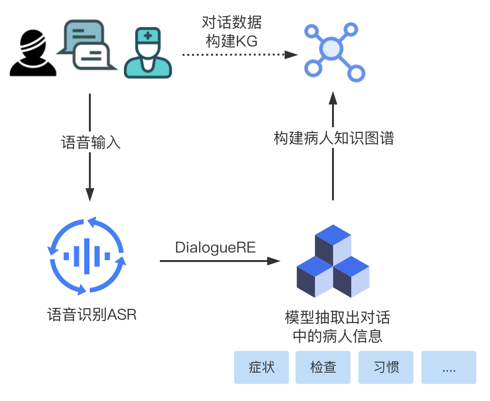

- 首先可以选择上传对话音频，或者是进行实时录制音频上传。然后给图谱取名。
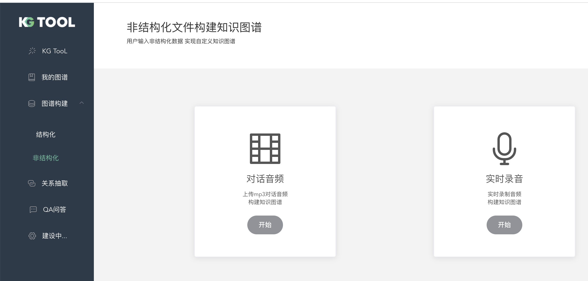
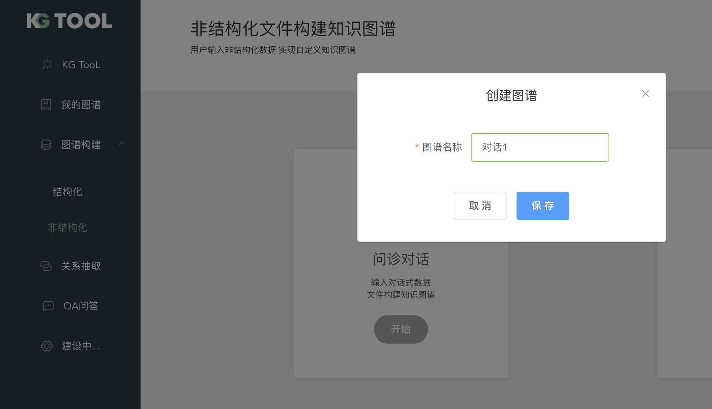

- 然后通过ASR技术对录音进行文字提取。
> Automated speech recognition (ASR) is a technology that allows users of information systems to speak entries rather than punching numbers on a keypad.

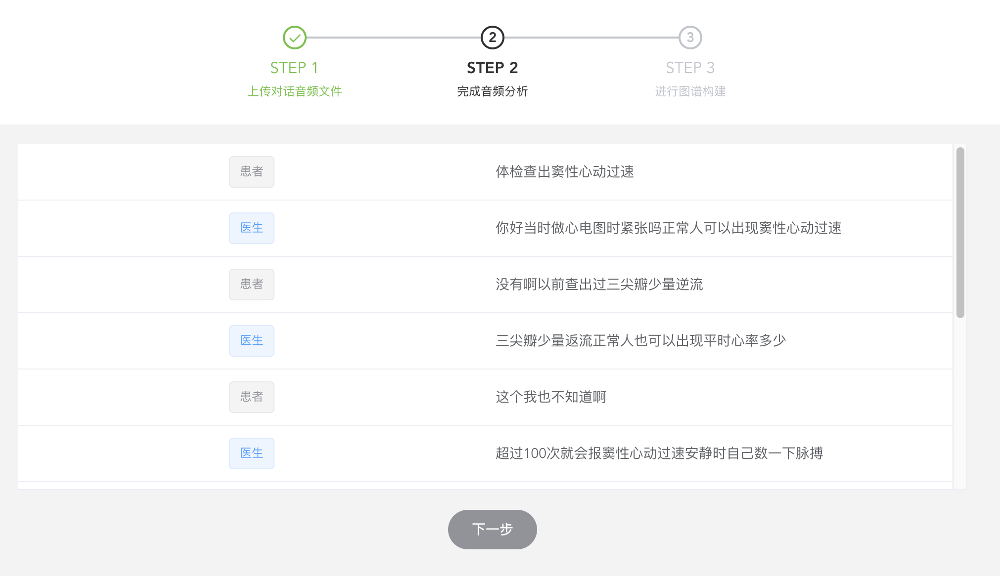

- 点击下一步， 当前音频的知识图谱将被构建。点击节点和关系可以查看详细属性。
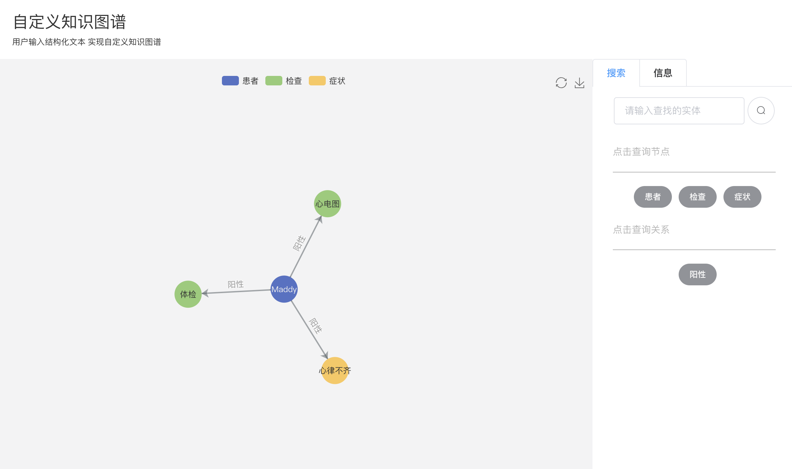
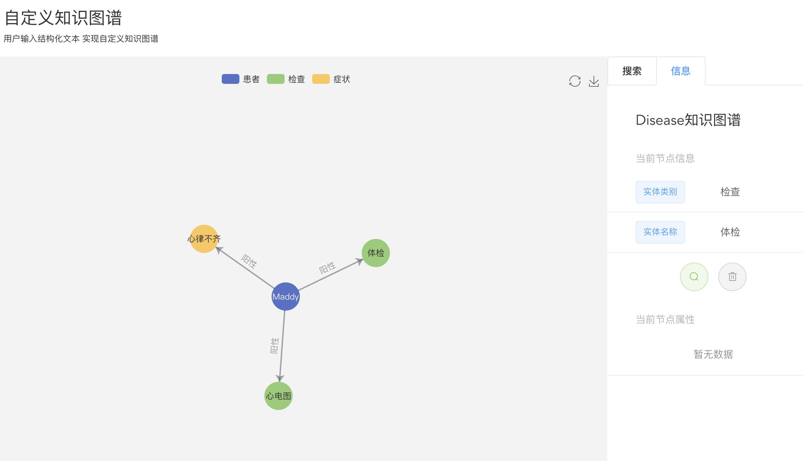


## 5.医学数据爬取
### 网络资讯采集脚本
- prepare_data/data_spider.py：网络资讯采集脚本（约170行代码）
- 爬取网站：https://jib.xywy.com/
首先通过urllib库根据首页url请求html文件。然后对html里的文件进行url解析，获取更多医学领域分类信息的url，继续进行爬取。接下来对爬取的文件进行基本信息解析，分成医保疾病，就诊科室，治疗周期，药品推荐等25类信息。

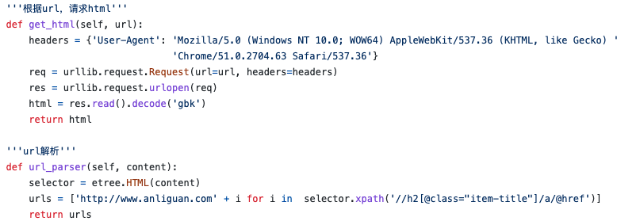
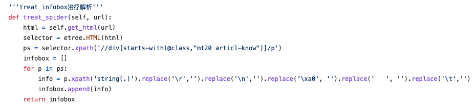

### 分词
- prepare_data/max_cut.py：基于词典的最大向前/向后切分脚本（约100行代码）
分词的部分通过双向最大匹配法匹配语料中在词库中的词汇。双向最大匹配法是将正向最大匹配法得到的分词结果和逆向最大匹配法的到的结果进行比较，从而决定正确的分词方法。
在这里使用了启发式规则：
1. 如果正反向分词结果词数不同，则取分词数量较少的那个。
2. 如果分词结果词数相同：分词结果相同，就说明没有歧义，可返回任意一个；分词结果不同，返回其中单字较少的那个。
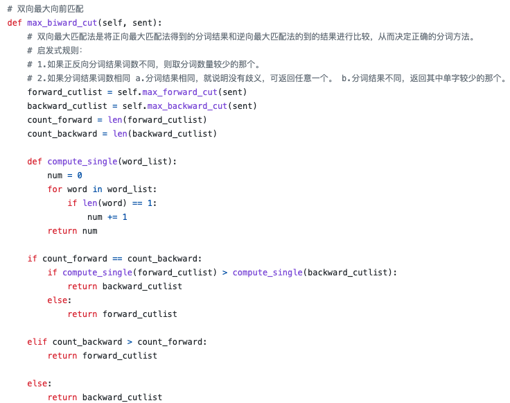

最后总共获得实体规模4.4万，实体关系规模30万的医学领域数据。
