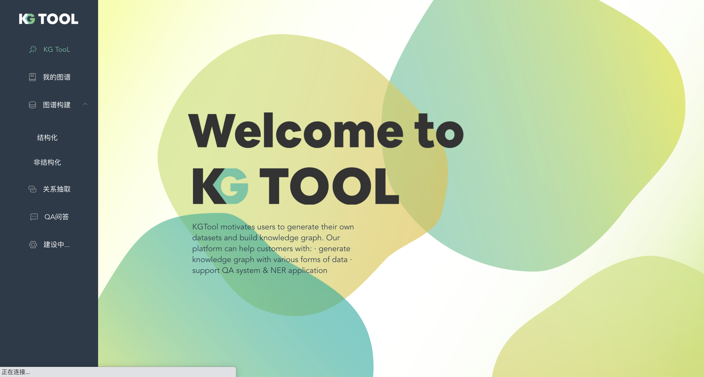
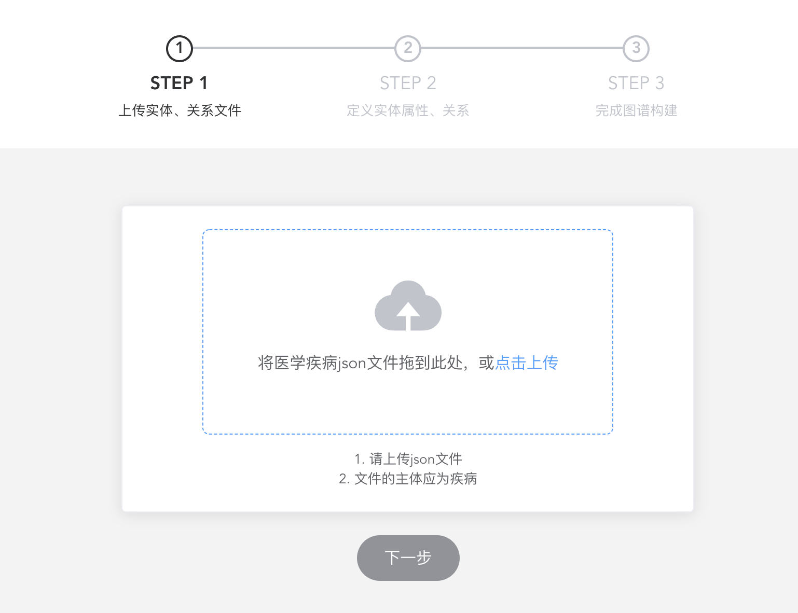

# 知识图谱构建平台

## 总体介绍
这是个知识图谱构建平台，目前以医学领域为例。可以通过实体关系文件单独构建图谱，也可以通过json文件直接构建图谱。

## 页面及功能介绍

### 首页

首页的左边是功能栏，用于构建图谱，以及切换知识图谱的应用，例如实体关系识别等。

### 知识图谱构建方法

#### 通过Json文件构建
在点击疾病文件后，选择相应json文件上传。文件会默认上传到Neo4j数据库的import文件夹下。

#### 
